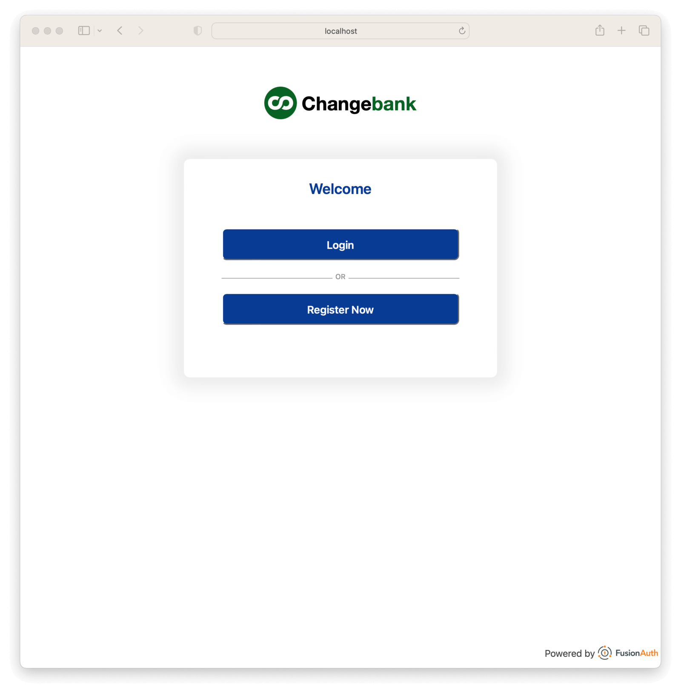

# Example: Using React and the FusionAuth React SDK

This repository contains example usage of the [FusionAuth React SDK](https://github.com/FusionAuth/fusionauth-react-sdk). It provides an example React client that uses the SDK, and an example Express server that is used to complete the OAuth token exchange.

## Overview

This example repo consists of two parts:

- `client` contains the React client application code which utilizes the FusionAuth React SDK
- `server` contains an Express server app which is used to securely perform the token exchange

The React client shows example usage of the SDK and integrates with [React Router v6](https://reactrouter.com/en/main).

## Setup

### Prerequisites
- [Yarn](https://classic.yarnpkg.com/lang/en/): This will be needed for pulling down the various dependencies.
- [NodeJS](https://nodejs.org/en/): This will be used in order to run the node server.
- [FusionAuth](https://fusionauth.io): This is the auth server. Install in one of two ways:
  - [Docker](https://www.docker.com): The quickest way to stand up FusionAuth.
  - [Install FusionAuth Manually](https://fusionauth.io/docs/v1/tech/installation-guide/).

### FusionAuth Setup

You can do this one of two ways, [using Docker and Kickstart](#docker) or [manually by logging into the FusionAuth administrative user interface](#manual-configuration).

#### Docker

If you run FusionAuth from a Docker container, in the root of this project directory (next to this README) are two files [a Docker compose file](./docker-compose.yml) and an [environment variables configuration file](./.env). Assuming you have Docker installed on your machine, a `docker-compose up` will bring FusionAuth up on your machine.

The FusionAuth configuration files also make use of a unique feature of FusionAuth, called Kickstart: when FusionAuth comes up for the first time, it will look at the [Kickstart file](./kickstart/kickstart.json) and mimic API calls to configure FusionAuth for use. It will perform all the necessary setup to make this demo work correctly, but if you are curious as to what the setup would look like by hand, the "FusionAuth configuration (by hand)" section of this README describes it in detail.

For now, get FusionAuth in Docker up and running (via `docker-compose up`) if it is not already running; to see, [click here](http://localhost:9011/) to verify it is up and running.

> **NOTE**: If you ever want to reset the FusionAuth system, delete the volumes created by docker-compose by executing `docker-compose down -v`. FusionAuth will only apply the Kickstart settings when it is first run (e.g., it has no data configured for it yet).

If you are using Docker:

* Your client Id is: `e9fdb985-9173-4e01-9d73-ac2d60d1dc8e`
* Your client secret is: `super-secret-secret-that-should-be-regenerated-for-production`
* Your example username is `richard@example.com` and your password is `password`.
* Your admin username is `admin@example.com` and your password is `password`.
* Your fusionAuthBaseUrl is 'http://localhost:9011/'

You can log into the [FusionAuth admin UI](http://localhost:9011/admin) and look around if you want, but with Docker/Kickstart you don't need to.

You're all done with FusionAuth setup. Skip ahead to the [Express Server Setup](#express-server-setup) section.

#### Manual Configuration

Log into the [FusionAuth admin UI](http://localhost:9011/admin).

Go to the Applications section.

* Create an Application using the green button.

* On the OAuth tab:

1. Give it a name
2. Make sure the authorization code grant is enabled
3. Add the following to the authorized redirect URLs for your application: `http://localhost:3000` and `http://localhost`
4. Add the following to the authorized request origins URLs for your application: `http://localhost:9000` and `http://localhost`
5. Add the following to the logout URL: `http://localhost:3000`
6. Click save.
7. Edit the application again. 
8. Record the client Id and secret, you'll use that below.

* On the registration tab, ensure self service registration is enabled.

* Save the application again.

Go to the Users section.

* Create a user if needed.

Go to the Themes section, under Customization.

1. Duplicate the FusionAuth theme.
2. Provide a name, such as 'React theme'.
3. Copy the contents of the file at `kickstart/css/styles.css` into the `styles` theme field.
4. Save the theme.

Go to the Tenants section.

1. Edit the default tenant
2. On the General tab, update the tenant theme to be your new theme; 'React theme' if you used that name.
3. Save the tenant.

FusionAuth is all set up. Proceed to the [Express Server Setup](#express-server-setup) section.

### Express Server Setup

From the `server` directory:

1. Update `config.js` if you aren't using docker/kickstart
2. Run `yarn install` to install dependencies
3. Run `yarn start` to start the server at [http://localhost:9000](http://localhost:9000)

### React Client Setup
From the `client` directory:
1. Update `src/config.ts` if you aren't using docker/kickstart
2. Run `yarn install` to install dependencies
3. Run `yarn start` to start your React app at [http://localhost:3000](http://localhost:3000)

### Test It Out

Visit the [React app](http://localhost:3000). You should be able to log in, log out and register a new user.

## SDK Examples

Three files in particular demonstrate the usage of the SDK. Check out the following:

- `client/src/FusionAuthProviderWithRedirectHandling.tsx` - custom redirect handling to integrate with React Router
- `client/src/pages/LoginPage.tsx` - a simple login page that pulls loading/authentication state out of FusionAuth context via `useFusionAuth()` as well as the out-of-the-box Login and Register buttons
- `client/src/pages/AccountPage.tsx` - a simple account page that 
  - wraps page in `RequireAuth` component to protect information from unauthorized users.
  - pulls user state from the FusionAuth context via `useFusionAuth()` to display information about the authenticated user

### Server Endpoint Requirements

The server you configure to use with the React SDK must have a `/token-exchange` endpoint to perform the exchange,
a `/logout` endpoint to clear tokens, and optionally a `/jwt-refresh` endpoint if you wish to use refresh tokens.

You can check out `server/routes/token-exchange.js`, `server/routes/logout.js`, and `server/routes/jwt-refresh.js` to see how these endpoints are
implemented.  (Note: the [Known Issue](https://github.com/FusionAuth/fusionauth-react-sdk#known-issues) of multiple requests made to token-exchange may return 503 responses.  These can be ignored.)

At a high level:

- `token-exchange.js` calls out to the [FusionAuth OAuth Token](https://fusionauth.io/docs/v1/tech/oauth/endpoints#token) endpoint to get an access token and refresh token, which are both stored in secure cookies
- `jwt-refresh.js` calls out to the [FusionAuth JWT Refresh](https://fusionauth.io/docs/v1/tech/apis/jwt#refresh-a-jwt) endpoint to exchange the refresh token for a new access token
- `logout.js` clears the access token and refresh tokens

See the [SDK Server Code Requirements](https://github.com/FusionAuth/fusionauth-react-sdk#server-code-requirements) for more detail.
